# Junie's Arcade - System Diagrams

This document contains all architectural and flow diagrams for Junie's Arcade, built for the **Cloud9 x JetBrains "Sky's the Limit" Hackathon - Category 4: Event Mini-Game**.

---

## Table of Contents

1. [System Architecture](#1-system-architecture)
2. [User Flow](#2-user-flow)
3. [Tournament Flow](#3-tournament-flow)
4. [Game Flow Diagrams](#4-game-flow-diagrams)
5. [Database Schema](#5-database-schema)
6. [API Architecture](#6-api-architecture)
7. [Component Architecture](#7-component-architecture)
8. [Champion Points Calculation](#8-champion-points-calculation)
9. [Achievement Card Flow](#9-achievement-card-flow)
10. [Deployment Architecture](#10-deployment-architecture)

---

## 1. System Architecture

High-level overview of Junie's Arcade system components.

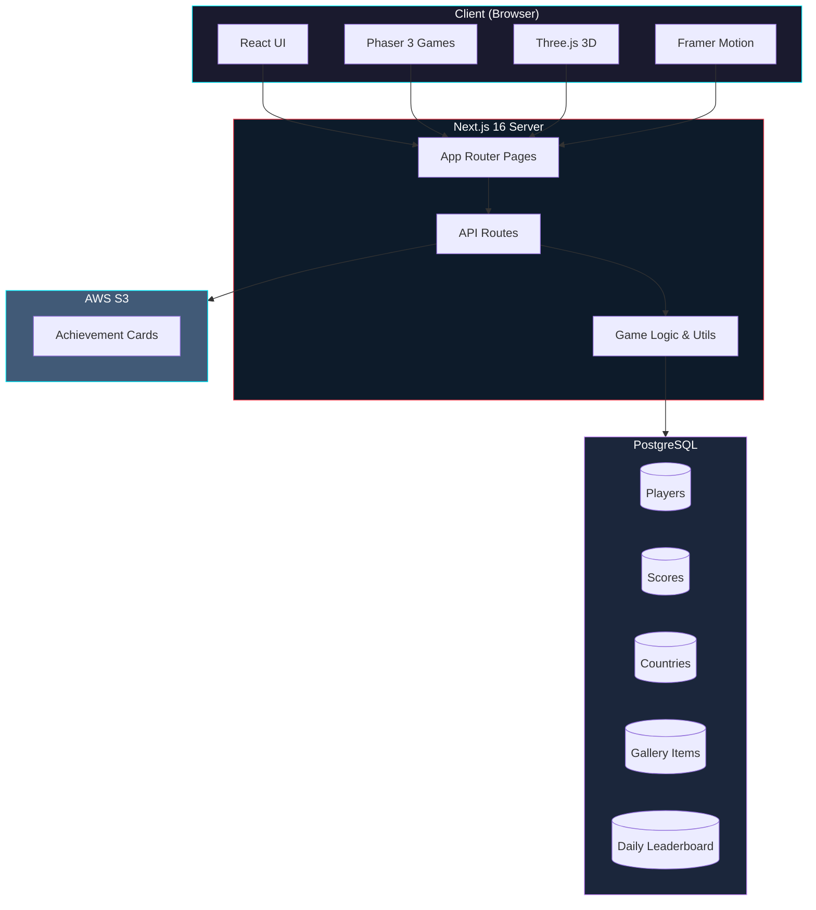

---

## 2. User Flow

Complete user journey from landing to achievement card.

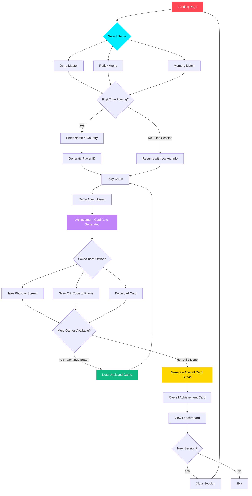

---

## 3. Tournament Flow

How a player progresses through the tournament. One Player ID is used for all games in a session - each game can only be played once per session.

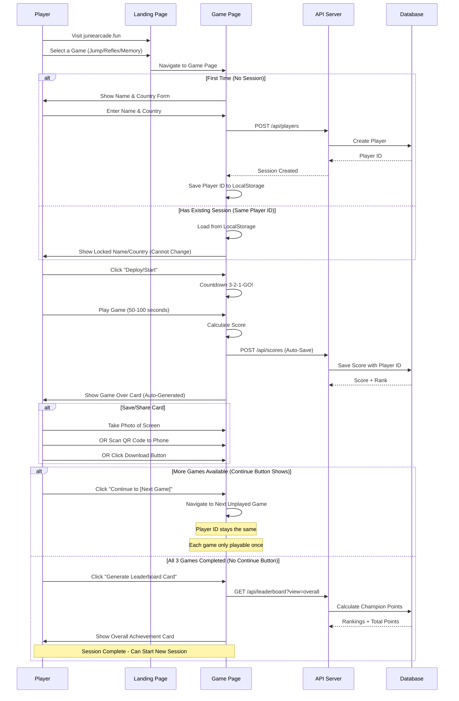

---

## 4. Game Flow Diagrams

### 4.1 Jump Master Game Flow

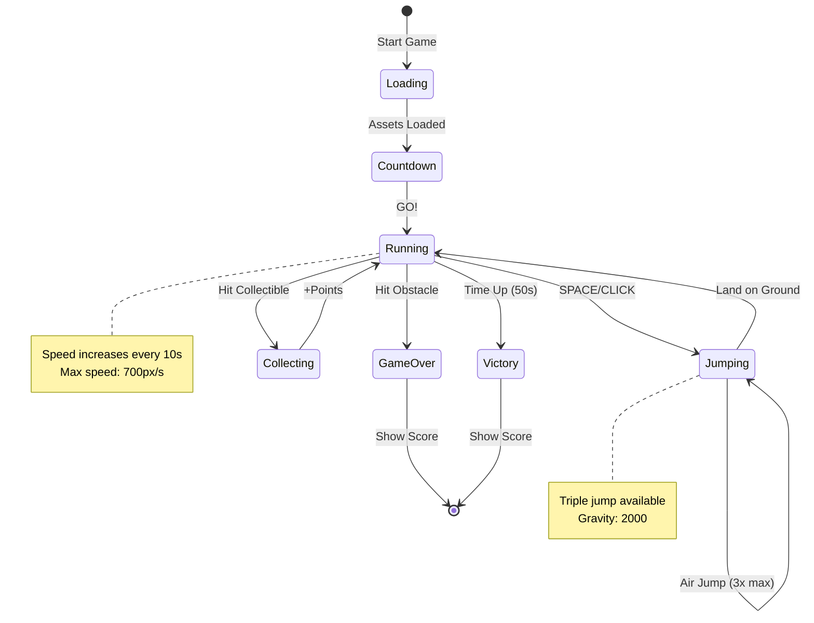

### 4.2 Reflex Arena Game Flow

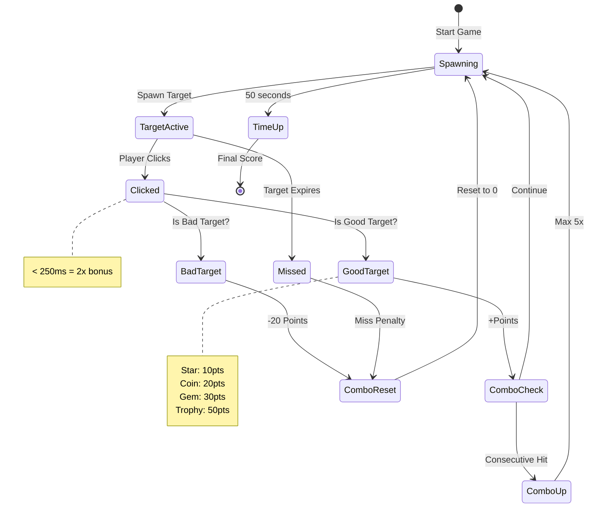

### 4.3 Memory Match Game Flow

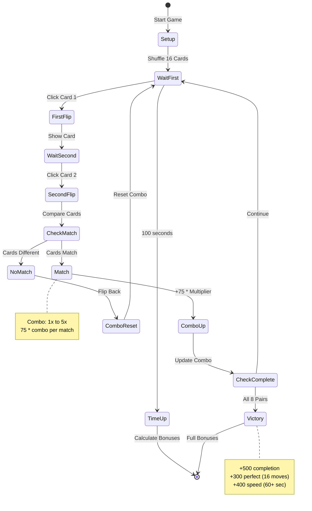

---

## 5. Database Schema

Entity Relationship Diagram for the database.

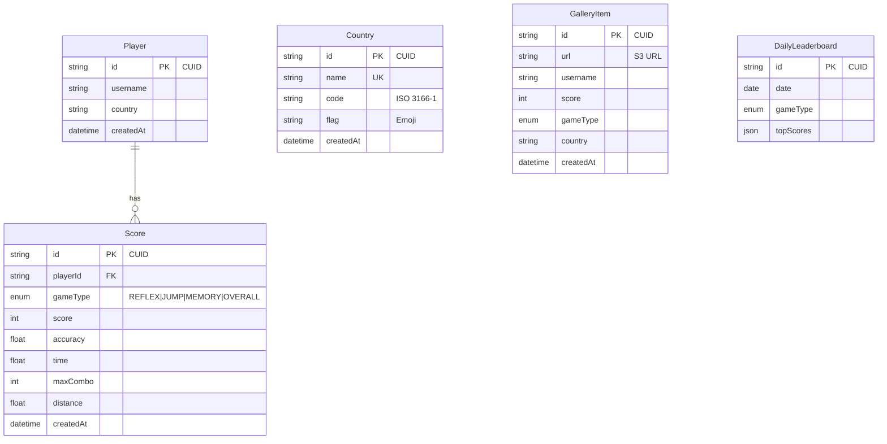

---

## 6. API Architecture

REST API endpoint structure.

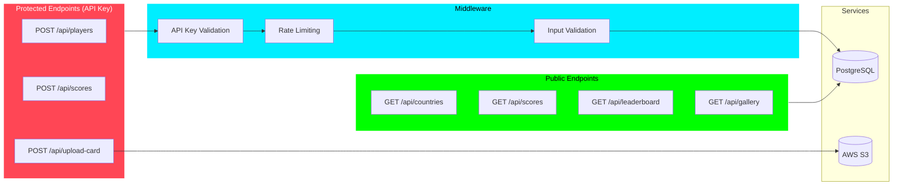

### API Request Flow

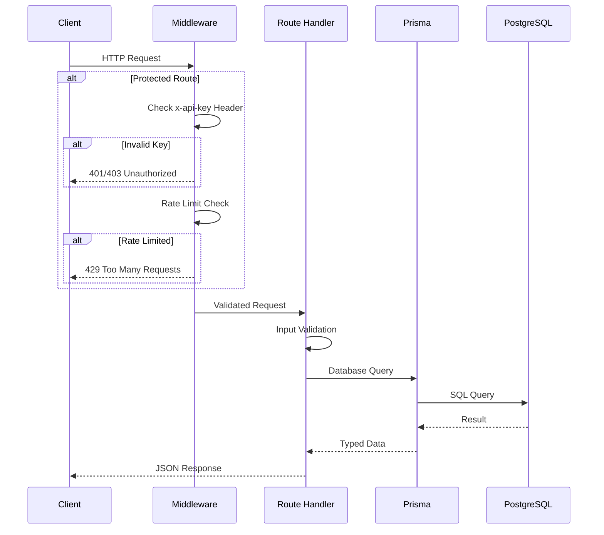

---

## 7. Component Architecture

React component hierarchy.

```mermaid
flowchart TD
    subgraph Layout["Root Layout"]
        HTML[HTML/Body]
        Providers[Context Providers]
    end

    subgraph Pages["App Pages"]
        Home[Home Page]
        Games[Game Pages]
        LB[Leaderboard Page]
        Gallery[Gallery Page]
        Merch[Merchandise Page]
    end

    subgraph GamePages["Game Pages"]
        Jump[Jump Master]
        Reflex[Reflex Arena]
        Memory[Memory Match]
    end

    subgraph Components["Shared Components"]
        Nav[Navigation]
        Hero[Hero Animations]
        Card[Achievement Card]
        Board[Leaderboard]
        Music[Music System]
    end

    subgraph GameComponents["Game Components"]
        PhaserGame[Phaser Game Container]
        GameUI[Game UI Overlay]
        GameOver[Game Over Screen]
        Entry[Game Entry Form]
    end

    HTML --> Providers
    Providers --> Pages

    Home --> Nav
    Home --> Hero

    Games --> GamePages
    GamePages --> GameComponents

    Jump --> PhaserGame
    Reflex --> PhaserGame
    Memory --> GameUI

    LB --> Board
    Gallery --> Card

    style Layout fill:#1a1a2e,stroke:#00eeff
    style Pages fill:#0d1b2a,stroke:#ff4655
    style Components fill:#1b263b,stroke:#c284f9
```

---

## 8. Champion Points Calculation

How Champion Points are calculated and ranked.

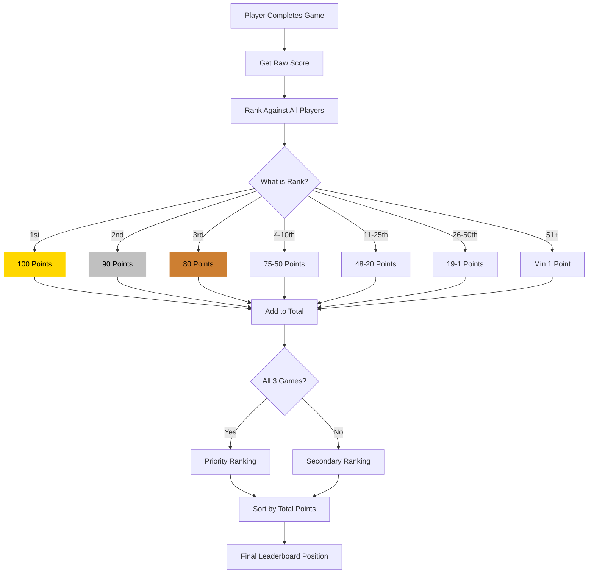

### Points Formula

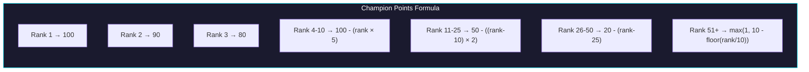

---

## 9. Deployment Architecture

Production deployment setup.

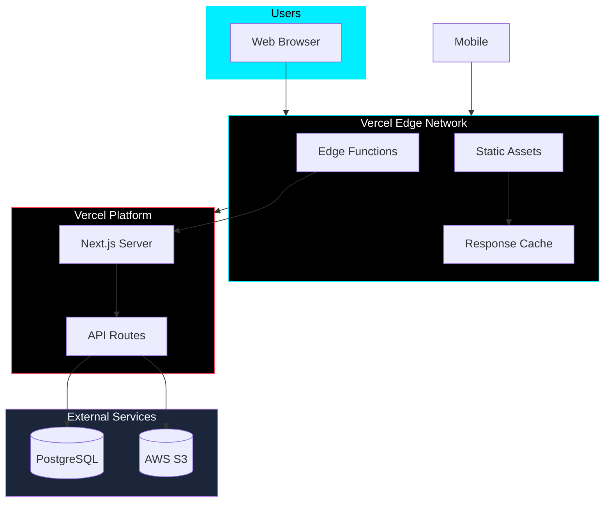

---

## Hackathon Context

This project is submitted for **Category 4: Event Mini-Game** of the Cloud9 x JetBrains "Sky's the Limit" Hackathon.

### Requirements Met

| Requirement               | Implementation            |
| ------------------------- | ------------------------- |
| Fast & Engaging (< 3 min) | 50-100 second games       |
| Intuitive Controls        | Mouse/click + SPACE only  |
| Thematic                  | VALORANT/LoL aesthetic    |
| Live Leaderboard          | Real-time Champion Points |
| High Replayability        | Session-based competition |

---

## Quick Links

- [Main README](../README.md)
- [API Documentation](../app/api/README.md)
- [Database Documentation](../prisma/README.md)
- [Gameplay Guide](../how_game_is_work.md)
- [Scoring System](../LEADERBOARD_SCORING.md)

---

Built with love for the Cloud9 x JetBrains Hackathon 2026
